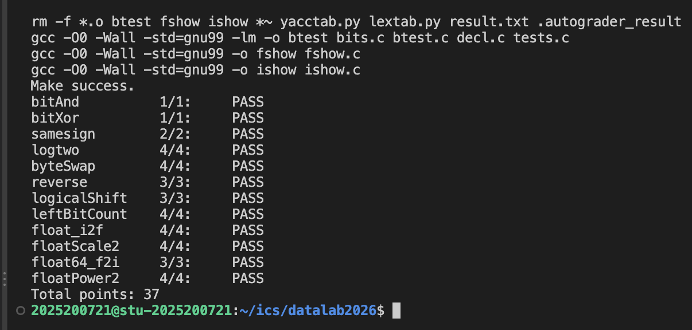

# datalab 报告

姓名:李浩嘉

学号:2025200721

| bitAnd | bitXor | samesign | logtwo | byteSwap | reverse | logicalShift | leftBitCount | float_i2f | floatScale2 | float64_f2i | floatPower2 | 总分 |
| --- | --- | --- | --- | --- | --- | --- | --- | --- | --- | --- | --- | --- |
| 1 | 1 | 2 | 4 | 4 | 3 | 3 | 4 | 4 | 4 | 3 | 4 | 37 |

test 截图:



## 解题报告

### 亮点

<!-- TODO: 从下面挑 2~3 个你自己最有感觉的,每个配一句话理由。候选:leftBitCount(左移把前导0挤出顶端的二分写法)/ float_i2f(向偶舍入的完整处理)/ logtwo(没有 if,用"比较当数值"实现条件移位)/ reverse(循环弹牌压牌)。写完删掉本注释 -->

1. TODO
2. TODO

### bitAnd(1 分)

<!-- TODO 思路提示:为什么 x&y 可以写成 ~(~x|~y)?这是哪条布尔代数定律?2~3 句话。写完删掉本注释 -->

思路:TODO

```c
int bitAnd(int x, int y) {
    return ~(~x | ~y);
}
```

### bitXor(1 分)

<!-- TODO 思路提示:异或 = "至少一个1" 且 "不同时为1",两个条件分别怎么用 ~ 和 & 造出来?和 bitAnd 是什么关系(镜像)?写完删掉本注释 -->

思路:TODO

```c
int bitXor(int x, int y) {
    return ~(~x & ~y) & ~(x & y);
}
```

### samesign(2 分)

<!-- TODO 思路提示:x>>31 怎么当"负数探测器"?为什么 0 要单独处理("0 既非正也非负")?你是怎么区分"双0/双负/双正"三种同号的?写完删掉本注释 -->

思路:TODO

```c
int samesign(int x, int y) {
    int x_sign=x>>31;
    int y_sign=y>>31;
    if(!x&&!y){
        return 1;
    }
    if(x_sign&&y_sign){
        return 1;
    }
    if((x&&y)&&(!x_sign&&!y_sign)){
        return 1;
    }
    return 0;
}
```

<!-- 可选 TODO 踩坑:如果想说,这里可以写你调试时把 & 写成 && 导致 samesign(1,2) 出错的经历 -->

### logtwo(4 分)

<!-- TODO 思路提示:log2(v) = 最高位1的位置 → 怎么用"16/8/4/2/1"五问二分定位?这题不允许 if,(v>65535) 这个比较表达式怎么当数值用(0/1)?移位量 (check<<4) 起什么作用?写完删掉本注释 -->

思路:TODO

```c
int logtwo(int v) {
    int result=0;
    int check;
    check=(v>65535);
    v=v>>(check<<4);
    result=result|(check<<4);
    check=(v>255);
    v=v>>(check<<3);
    result=result|(check<<3);
    check=(v>15);
    v=v>>(check<<2);
    result=result|(check<<2);
    check=(v>3);
    v=v>>(check<<1);
    result=result|(check<<1);
    check=(v>1);
    v=v>>(check);
    result=result|(check);
    return result;
}
```

<!-- 可选 TODO 踩坑:阈值 65535 还是 65536?边界值 2^k 上的 off-by-one -->

### byteSwap(4 分)

<!-- TODO 思路提示:三步曲——摘((x>>(n<<3))&0xFF)、擦(两个字节掩码先"或"再取反)、交叉放回。为什么 n<<3 等于 n*8?写完删掉本注释 -->

思路:TODO

```c
int byteSwap(int x, int n, int m) {
    int ns=n<<3;
    int ms=m<<3;
    int n_byte=(x>>ns)&0xFF;
    int m_byte=(x>>ms)&0xFF;
    int mask=~((0xFF<<ns)|(0xFF<<ms));
    x=x&mask;
    x|=(n_byte<<ms)|(m_byte<<ns);
    return x;
}
```

### reverse(3 分)

<!-- TODO 思路提示:32轮"弹牌压牌"循环,循环不变式是什么(r 和 v 每轮怎么变)?为什么参数必须是 unsigned(逻辑右移 vs 算术右移)?为什么循环条件写光秃秃的 i、计数用 i=i-1(合法性清单里没有 < 和 ++)?写完删掉本注释 -->

思路:TODO

```c
unsigned reverse(unsigned v) {
    unsigned r=0;
    int i;
    for(i=32;i;i=i-1){
        r=(r<<1)|(v&1);
        v=v>>1;
    }
    return r;
}
```

### logicalShift(3 分)

<!-- TODO 思路提示:int 的 >> 是算术右移(补符号位),负数高 n 位被污染 → 先右移再用掩码擦掉高 n 位。掩码为什么用 ((1<<31)>>n)<<1 再取反来造,而不是 (1<<(32-n))-1(提示:- 被禁、n=0 时 1<<32 是未定义行为)?写完删掉本注释 -->

思路:TODO

```c
int logicalShift(int x, int n) {
    x=x>>n;
    int mask=~(((1<<31)>>n)<<1);
    x=x&mask;
    return x;
}
```

### leftBitCount(4 分)

<!-- TODO 思路提示:先取反,把"数前导1"变成"数前导0" → 二分五问。妙点1:命中后用"左移"把确认过的0从顶端挤出,而第一个1上方全是0所以永远不会被挤丢(窗口顶端钉在bit31)。妙点2:五问最多数到31,最后 +!inv 补上 x=-1(全1)的第32个。写完删掉本注释 -->

思路:TODO

```c
int leftBitCount(int x) {
    int inv=~x;
    int r=0;
    int b;

    b=!(inv>>16);
    r=r+(b<<4);
    inv=inv<<(b<<4);

    b=!(inv>>24);
    r=r+(b<<3);
    inv=inv<<(b<<3);

    b=!(inv>>28);
    r=r+(b<<2);
    inv=inv<<(b<<2);

    b=!(inv>>30);
    r=r+(b<<1);
    inv=inv<<(b<<1);

    b=!(inv>>31);
    r=r+b;

    return r+!inv;
}
```

<!-- 可选 TODO 踩坑:移位量写成 (b<<16) 而不是 (b<<4)——移位量对32取模,等于没移 -->

### float_i2f(4 分)

<!-- TODO 思路提示:五步流水线:拆符号(负数取绝对值,~ux+1)→规格化(左移到最高位是1,数出真实指数E)→砍尾数(23格以后的8格装不下)→向偶舍入(g>0x80进位;g==0x80看frac奇偶,偶留奇进——为什么?统计无偏)→进位冲出23格时frac归零E加1。写完删掉本注释 -->

思路:TODO

```c
unsigned float_i2f(int x) {
    unsigned sign=0;
    unsigned ux=x;
    unsigned E,frac,g;

    if(x==0)return 0;
    if(x<0){
        sign=0x80000000;
        ux=~ux+1;
    }

    E=31;
    while(!(ux&0x80000000)){
        ux=ux<<1;
        E=E-1;
    }
    frac=(ux>>8)&0x7FFFFF;
    g=ux&0xFF;

    if(g>0x80){
        frac=frac+1;
    }else if(g==0x80){
        if(frac&1)frac=frac+1;
    }
    if(frac==0x800000){
        frac=0;
        E=E+1;
    }
    return sign|((E+127)<<23)|frac;
}
```

### floatScale2(4 分)

<!-- TODO 思路提示:四种情况分派——exp==255(∞/NaN)原样返回;exp==254(最大规格化)翻倍溢出→±∞(为什么不能直接+1?会变成NaN);exp==0(非规格化)尾数左移一位就是翻倍,最高位进位恰好落到最小规格化数上;普通情况指数+1(uf+(1<<23))。写完删掉本注释 -->

思路:TODO

```c
unsigned floatScale2(unsigned uf) {
    unsigned sign=uf&0x80000000;
    unsigned exp=(uf>>23)&0xFF;
    if(exp==255){
        return uf;
    }
    if(exp==0){
        return sign|((uf<<1)&0x7FFFFFFF);
    }
    if(exp==254){
        return sign|0x7F800000;
    }
    return uf+(1<<23);
}
```

<!-- 可选 TODO 踩坑:读指数忘了 >>23,拿"原地掩码值"去比255永远不成立 -->

### float64_f2i(3 分)

<!-- TODO 思路提示:64位双精度=1+11+52、偏置1023,uf2高32位含符号+指数+尾数前20格。先出局三种(∞/NaN、|值|<1、E>30 溢出),剩下的把"隐藏1+52格尾数"右移(52-E)取整数部分——53位装不进一个32位字,所以按E=20为界拆成高21格、低32格两段分别移再拼,最后贴符号(~result+1)。写完删掉本注释 -->

思路:TODO

```c
int float64_f2i(unsigned uf1, unsigned uf2) {
    unsigned s=uf2>>31;
    unsigned e=(uf2>>20)&0x7FF;
    int E=e-1023;
    unsigned top21=(uf2&0xFFFFF)|0x100000;
    unsigned result;

    if(e>=0x7FF) return 0x80000000;
    if(E<0) return 0;
    if(E>30) return 0x80000000;

    if(E<=20){
        result=top21>>(20-E);
    }
    else{
        result = (top21 << (E - 20)) | (uf1 >> (52 - E));
    }
    if (s) return ~result + 1;
    return result;
}
```

<!-- 可选 TODO 踩坑:这题合法清单里没有 ==,用 e>=0x7FF 代替(掩码保证e不超过0x7FF) -->

### floatPower2(4 分)

<!-- TODO 思路提示:查三区间——x>127 溢出返回+∞(0xFF<<23);-126≤x≤127 规格化,exp=x+127 尾数全0,直接 (x+127)<<23;-149≤x≤-127 非规格化,值=0.frac×2^-126,frac=1<<(x+149);再小返回0。写完删掉本注释 -->

思路:TODO

```c
unsigned floatPower2(int x) {
    if(x>127){
        return 0xFF<<23;
    }
    if(x>=-126){
        return (x+127)<<23;
    }
    if(x>=-149){
        return 1<<(x+149);
    }
    return 0;
}
```

## 反馈/收获/感悟/总结

<!-- TODO(200字以内,可以不写,但写了很加分):比如——第一次在远程Linux环境做实验的体验;对"合法运算符清单"限制从嫌烦到理解(它在逼你用位运算思维);印象最深的一个bug;2.4节理论和你动手造浮点数的对应关系。写完删掉本注释 -->

TODO

## 参考的重要资料

<!-- TODO:如实列出,比如 CSAPP《深入理解计算机系统》第2章、课程PPT/回放、课程群通知的服务器使用说明等。没有就不写这节。写完删掉本注释 -->

TODO
